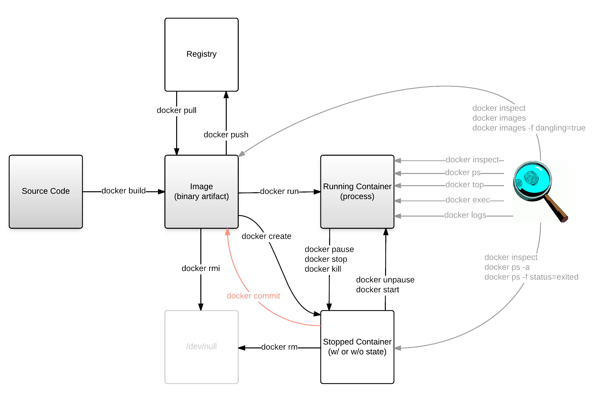

Docker Training
===============

Before this training
--------------------

You...

* have heard about Docker
* know that people who already use Docker are excited about it
* know the basics of a Linux shell
* know how to use `ssh`

After this training
-------------------

What's in this training
-----------------------

* Docker engine
* Docker client
* CoreOS

What's not in this training
---------------------------

* Docker machine
* Docker compose
* Docker swarm
* Visual Studio
